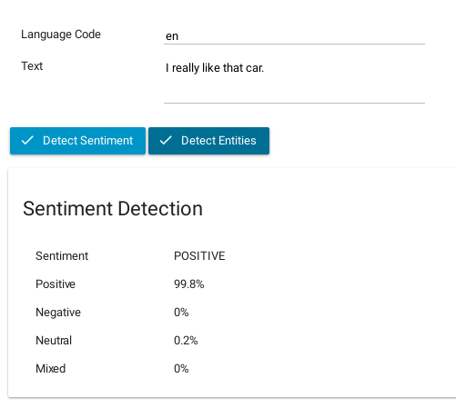
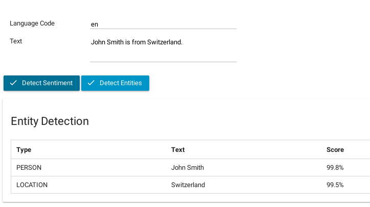
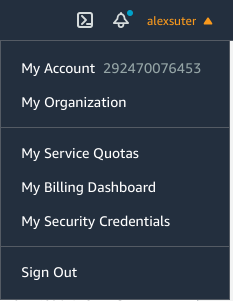

### Accelerate Process Automation with NLP and ML

Axon Ivy’s [Amazon Comprehend API](https://aws.amazon.com/comprehend/) connector enables you to enhance your process automation initiatives by leveraging the power of Natural Language Processing (NLP) and Machine Learning (ML). This connector seamlessly integrates Amazon Comprehend's capabilities into your process work, allowing you to discover valuable insights and relationships hidden within text data.

Key features and benefits:

- **Freemium Pricing Model**: The connector is based on AWS's freemium pricing model, providing cost-effective access to advanced NLP and ML functionalities.

- **Comprehensive NLP APIs**: Gain access to a wide range of APIs, including Keyphrase Extraction, Sentiment Analysis, Entity Recognition, Topic Modeling, and Language Detection. These APIs empower you to extract meaningful information from unstructured text data.

- **Identify Critical Elements**: Amazon Comprehend helps you identify crucial elements within your data, such as references to languages, people, and places. This enables you to gain a deeper understanding of your text-based information and make informed decisions.

- **Text Categorization**: Automatically categorize your text files based on relevant topics, making it easier to organize and analyze large volumes of data.

- **Demo Implementation**: To minimize your integration effort, Axon Ivy provides an easy-to-copy demo implementation. This sample code serves as a starting point, allowing you to quickly incorporate the Amazon Comprehend API into your own processes.

### How does it differ from ChatGPT?
If your primary goal is to perform **specific NLP tasks** like sentiment analysis or entity recognition on large volumes of text data, AWS Comprehend is a suitable choice. It offers pre-trained models, scalability, and **integration with the AWS ecosystem**. However, if you require a more **versatile language model** for open-ended conversations or generating human-like text, ChatGPT may be a better fit.


## Demo

### Sentiment Detection

1. Type any text you like into the text field like: _I really like that car_.
2. Click on Detect Sentiment
3. Amazon Comprehend will detect the sentiment for you.



### Entities Detection

1. Type any text you like into the text field like: _John Smith is from Switzerland_.
2. Click on Detect Entities
3. Amazon Comprehend will detect the entities for you.




## Setup

1. First you need to create a secret key and an access key for Amazon.
   Go to https://aws.amazon.com

2. Login or create a new account.

3. Click on My Security credentials:



4. Create a new access key and a new secret key.


5. Configure the following variables in your project:

```
Variables:

  Amazon.Comprehend:

    # Secret key to access amazon comprehend     
    SecretKey: <YOUR_SECRET_KEY>
    
    # Access key to access amazon comprehend
    AccessKey: <YOUR_ACCESS_KEY>
```
