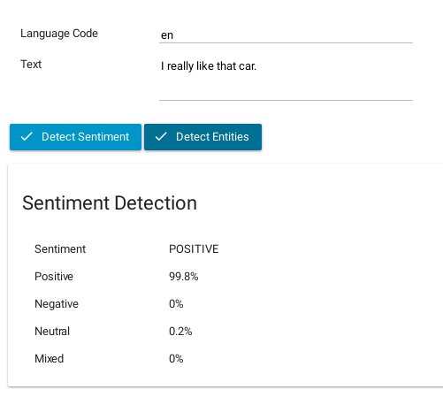
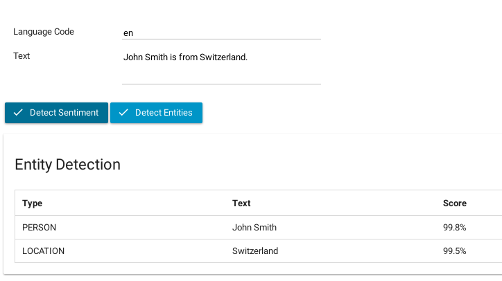
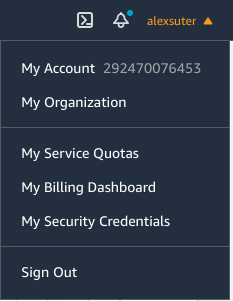
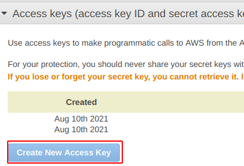

### Beschleunigen Sie die Prozessautomatisierung mit NLP und ML

Mit dem [Amazon Comprehend API]-Konnektor von Axon Ivy können Sie Ihre
Prozessautomatisierungsinitiativen verbessern, indem Sie die Leistungsfähigkeit
von Natural Language Processing (NLP) und Machine Learning (ML) nutzen. Dieser
Konnektor integriert die Funktionen von Amazon Comprehend nahtlos in Ihre
Prozessarbeit, sodass Sie wertvolle Erkenntnisse und Zusammenhänge entdecken
können, die in Textdaten verborgen sind.

Wichtigste Funktionen und Vorteile:

- **Freemium-Preismodell**: Der Konnektor basiert auf dem Freemium-Preismodell
  von AWS und bietet kostengünstigen Zugriff auf fortschrittliche NLP- und
  ML-Funktionen.

- **Umfassende NLP-APIs**: Erhalten Sie Zugriff auf eine Vielzahl von APIs,
  darunter Keyphrase Extraction, Sentiment Analysis, Entity Recognition, Topic
  Modeling und Language Detection. Mit diesen APIs können Sie aussagekräftige
  Informationen aus unstrukturierten Textdaten extrahieren.

- **Identifizieren Sie wichtige Elemente**: Amazon Comprehend hilft Ihnen dabei,
  wichtige Elemente in Ihren Daten zu identifizieren, wie beispielsweise
  Verweise auf Sprachen, Personen und Orte. So können Sie ein tieferes
  Verständnis Ihrer textbasierten Informationen gewinnen und fundierte
  Entscheidungen treffen.

- **Textkategorisierung**: Kategorisieren Sie Ihre Textdateien automatisch
  anhand relevanter Themen, um die Organisation und Analyse großer Datenmengen
  zu vereinfachen.

- **Demo-Implementierung**: Um Ihren Integrationsaufwand zu minimieren, bietet
  Axon Ivy eine einfach zu kopierende Demo-Implementierung. Dieser Beispielcode
  dient als Ausgangspunkt, damit Sie die Amazon Comprehend API schnell in Ihre
  eigenen Prozesse integrieren können.

### Wie unterscheidet es sich von ChatGPT?
** **Wenn Ihr primäres Ziel darin besteht, bestimmte NLP-Aufgaben** wie
Sentimentanalyse oder Entitätserkennung an großen Textdatenmengen durchzuführen,
ist AWS Comprehend eine geeignete Wahl. Es bietet vortrainierte Modelle,
Skalierbarkeit und **Integration in das AWS-Ökosystem**. Wenn Sie jedoch ein
vielseitigeres Sprachmodell** für offene Gespräche oder die Generierung
menschenähnlicher Texte benötigen, ist ChatGPT möglicherweise besser geeignet.


## Demo

### Sentimenterkennung

1. Typen Sie einen beliebigen Text in das Textfeld ein, z. B.: _Ich mag dieses
   Auto wirklich sehr_.
2. Klicken Sie auf „Stimmung erkennen“.
3. Amazon Comprehend erkennt die Stimmung für Sie.



### Entitätenerkennung

1. Typ einen beliebigen Text in das Textfeld ein, z. B.: _John Smith kommt aus
   der Schweiz_.
2. Klicken Sie auf „Entitäten erkennen“.
3. Amazon Comprehend erkennt die Entitäten für Sie.




## Einrichtung

1. Zunächst müssen Sie einen geheimen Schlüssel und einen Zugriffsschlüssel für
   Amazon erstellen. Gehen Sie dazu auf https://aws.amazon.com.

2. Melden Sie sich an oder erstellen Sie ein neues Konto.

3. Klicken Sie auf „Meine Sicherheitsanmeldedaten“:



4. Erstellen Sie einen neuen Zugriffsschlüssel und einen neuen geheimen
   Schlüssel.



5. Konfigurieren Sie die folgenden Variablen in Ihrem Projekt:

```
Variables:

  Amazon.Comprehend:

    # Secret key to access amazon comprehend     
    SecretKey: <YOUR_SECRET_KEY>

    # Access key to access amazon comprehend
    AccessKey: <YOUR_ACCESS_KEY>
```
