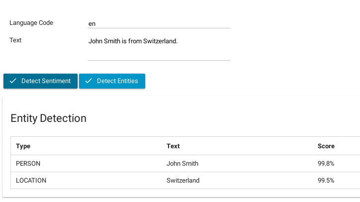
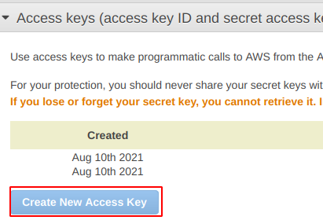

### Sprachverarbeitung mit Amazon Comprehend API

Der [Amazon Comprehend API](https://aws.amazon.com/comprehend/) Konnektor von Axon Ivy ermöglicht es dir Sprachverarbeitung durch die Integration von KI zu automatisieren.
Er stellt dir die  Leistungsfähigkeit der natürlichen Sprachverarbeitung (NLP) und von maschinellem Lernen (ML) zur Verfügung. Dieser Konnektor integriert  die Funktionen von Amazon Comprehend in deine Prozessimplementierung und erlaubt es, Erkenntnisse und Zusammenhänge zu entdecken, die in  unstrukturieren Textdaten verborgen sind.

Die wichtigsten Merkmale:
- **Freemium-Preismodell**: Der Konnektor basiert auf dem Freemium-Preismodell
 von AWS und bietet kostengünstigen Zugang zu  NLP- und ML-Funktionen. Damit kannst du die API kostenlos mit kleinen Datenmengen testen - für größere Datenmengen greift das [Preismodell von AWS](https://aws.amazon.com/de/comprehend/pricing/?pg=ln&sec=hs).
- **NLP-API**: Du erhälst Zugang auf eine breite Palette von APIs, darunter keyphrase - Extraktion, Stimmungsanalyse, Entitätserkennung, Topic Modeling  und Spracherkennung. Diese APIs ermöglichen es dir, die wichtigsten Informationen aus unstrukturierten Textdaten zu extrahieren.
- **Was ist wichtig?** : Amazon Comprehend hilft dir, Schlüsselelemente in deinen Daten zu  identifizieren, wie z.B. Verweise auf Sprachen, Personen und Orte. 
- **Textkategorisierung**: Kategorisiere deine Textdateien automatisch anhand relevanter Themen,  um vor allen Dingen große Datenmengen zu organisieren.
- **Demo-Implementierung**: Um deinen Integrationsaufwand zu minimieren, stellt Axon Ivy eine Demo-Implementierung bereit. Dieser Beispielcode kann die als Starthilfe für Deine eigene Implementierung dienen.

**Wie unterscheidet sich Amazon Comprehend von ChatGPT?**
Wenn es Dein Ziel ist, spezifische NLP-Aufgaben wie Stimmungsanalyse oder Entitätserkennung mit großen Textdatenmengen durchzuführen, dann ist AWS Comprehend eine gute Wahl. Es bietet pre-trained Modelle, Skalierbarkeit und die Integration in das AWS-Ökosystem. Wenn du jedoch ein vielseitigeres Sprachmodell für Gespräche oder die Generierung von Text benötigst, ist ChatGPT möglicherweise besser geeignet.

## Demo

### Sentiment Detection

1. Type any text you like into the text field like: _I really like that car_.
2. Click on Detect Sentiment
3. Amazon Comprehend will detect the sentiment for you.


### Entities Detection

1. Type any text you like into the text field like: _John Smith is from Switzerland_.
2. Click on Detect Entities
3. Amazon Comprehend will detect the entities for you.




## Setup

1. First you need to create a secret key and an access key for Amazon.
   Go to https://aws.amazon.com

2. Login or create a new account.

3. Click on My Security credentials:


4. Create a new access key and a new secret key.



5. Configure the following variables in your project:

```
Variables:

  Amazon.Comprehend:

    # Secret key to access amazon comprehend     
    SecretKey: <YOUR_SECRET_KEY>
    
    # Access key to access amazon comprehend
    AccessKey: <YOUR_ACCESS_KEY>
```

